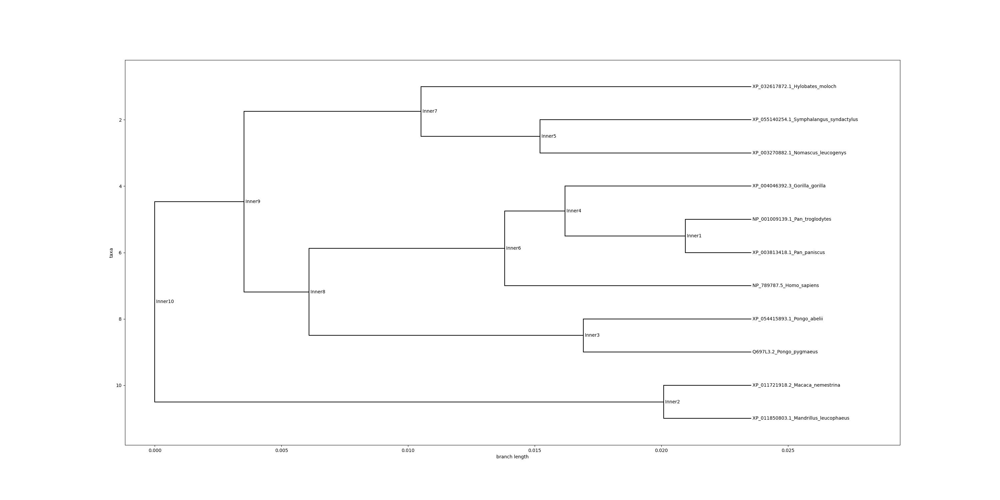

# Input sequence

The input sequence was AGGTCCTGGCTTGGAACGTACATTTACCTTTCTGCACTGGGTGGCAACCAGGTCTTTAGATTAGCCAACTAGAGAAGAGAAGTAGAATAGCCAATTAGAGAAGTGACATCATGTTGACTCTAACTCGCATCCGCACTGTGTCCTATGAAGTCAGGAGTACATTTCTGTTCATTTCAGTCCTGGAGTTTGCAGTGGGGTTTCTGACCAATGCCTTCGTTTTCTTGGTGAATTTTTGGGATGTAGTGAAGAGGCAGGCACTGAGCAACAGTGATTGTGTGCTGCTGTGTCTCAGCATCAGCCGGCTTTTCCTGCATGGACTGCTGTTCCTGAGTGCTATCCAGCTTACCCACTTCCAGAAGTTGAGTGAACCACTGAACCACAGCTACCAAGCCATCATCATGCTATGGATGATTGCAAACCAAGCCAACCTCTGGCTTGCTGCCTGCCTCAGCCTGCTTTACTGCTCCAAGCTCATCCGTTTCTCTCACACCTTCCTGATCTGCTTGGCAAGCTGGGTCTCCAGGAAGATCTCCCAGATGCTCCTGGGTATTATTCTTTGCTCCTGCATCTGCACTGTCCTCTGTGTTTGGTGCTTTTTTAGCAGACCTCACTTCACAGTCACAACTGTGCTATTCATGAATAACAATACAAGGCTCAACTGGCAGATTAAAGATCTCAATTTATTTTATTCCTTTCTCTTCTGCTATCTGTGGTCTGTGCCTCCTTTCCTATTGTTTCTGGTTTCTTCTGGGATGCTGACTGTCTCCCTGGGAAGGCACATGAGGACAATGAAGGTCTATACCAGAAACTCTCGTGACCCCAGCCTGGAGGCCCACATTAAAGCCCTCAAGTCTCTTGTCTCCTTTTTCTGCTTCTTTGTGATATCATCCTGTGCTGCCTTCATCTCTGTGCCCCTACTGATTCTGTGGCGCGACAAAATAGGGGTGATGGTTTGTGTTGGGATAATGGCAGCTTGTCCCTCTGGGCATGCAGCCATCCTGATCTCAGGCAATGCCAAGTTGAGGAGAGCTGTGATGACCATTCTGCTCTGGGCTCAGAGCAGCCTGAAGGTAAGAGCCGACCACAAGGCAGATTCCCGGACACTGTGCTGAGAATGGACATGAAATGAGCTCTTCATTAATACGCCTGTGAGTCTTCATAAATATGCCTCTGATTCTTCAGGAATACAACTCTGATTCCTCACAAAGCCTTCCAATTTCTTCTATAAAACACAATTGAAAGTCTCTCCACTTTGTATCAATGAACTCA

# Selected ORF

The selected ORF was VLAWNVHLPFCTGWQPGL*ISQLEKRSRIAN*RSDIMLTLTRIRTVSYEVRSTFLFISVLEFAVGFLTNAFVFLVNFWDVVKRQALSNSDCVLLCLSISRLFLHGLLFLSAIQLTHFQKLSEPLNHSYQAIIMLWMIANQANLWLAACLSLLYCSKLIRFSHTFLICLASWVSRKISQMLLGIILCSCICTVLCVWCFFSRPHFTVTTVLFMNNNTRLNWQIKDLNLFYSFLFCYLWSVPPFLLFLVSSGMLTVSLGRHMRTMKVYTRNSRDPSLEAHIKALKSLVSFFCFFVISSCAAFISVPLLILWRDKIGVMVCVGIMAACPSGHAAILISGNAKLRRAVMTILLWAQSSLKVRADHKADSRTLC*EWT*NELFINTPVSLHKYASDSSGIQL*FLTKPSNFFYKTQLKVSPLCINEL

# Proteins selected out of the BLAST search

1. ref|NP_789787.5|taste receptor type 2 member 38 [Homo sapiens] >sp|P59533.3| RecName: Full=Taste receptor type 2 member 38; Short=T2R38; AltName: Full=PTC bitter taste receptor; AltName: Full=Taste receptor type 2 member 61; Short=T2R61 [Homo sapiens] >gb|AAM63545.1| putative taste receptor T2R61 [Homo sapiens] >gb|AKI72549.1| TAS2R38, partial [synthetic construct]

2. ref|NP_001009139.1|taste receptor type 2 member 38 [Pan troglodytes] >sp|Q697L5.1| RecName: Full=Taste receptor type 2 member 38; Short=T2R38 [Pan troglodytes] >gb|AAS67622.1| taste receptor type 2 member 38 [Pan troglodytes] >gb|AFH77563.1| bitter taste receptor TAS2R38 [Pan troglodytes] >dbj|BAM38324.1| taste receptor, type 2, member 38 [Pan troglodytes] >dbj|BAM38325.1| taste receptor, type 2, member 38 [Pan troglodytes] >dbj|BAM38327.1| taste receptor, type 2, member 38 [Pan troglodytes]

3. ref|XP_004046392.3|taste receptor type 2 member 38 [Gorilla gorilla gorilla] >sp|Q697L4.1| RecName: Full=Taste receptor type 2 member 38; Short=T2R38 [Gorilla gorilla gorilla] >gb|AAS67623.1| taste receptor type 2 member 38 [Gorilla gorilla] >gb|AFH77565.1| bitter taste receptor TAS2R38 [Gorilla gorilla]

4. ref|XP_003813418.1|taste receptor type 2 member 38 [Pan paniscus] >sp|Q697L6.1| RecName: Full=Taste receptor type 2 member 38; Short=T2R38 [Pan paniscus] >gb|AAS67621.1| taste receptor type 2 member 38 [Pan paniscus] >gb|AAV28571.1| taste receptor T2R38 [Pan paniscus] >gb|AFH77564.1| bitter taste receptor TAS2R38 [Pan paniscus]

5. ref|XP_003270882.1|taste receptor type 2 member 38 [Nomascus leucogenys]

6. sp|Q697L3.2|RecName: Full=Taste receptor type 2 member 38; Short=T2R38 [Pongo pygmaeus]

7. ref|XP_055140254.1|taste receptor type 2 member 38 [Symphalangus syndactylus]

8. ref|XP_032617872.1|taste receptor type 2 member 38 [Hylobates moloch] >sp|Q697L2.1| RecName: Full=Taste receptor type 2 member 38; Short=T2R38 [Hylobates klossii] >gb|AAS67625.1| taste receptor type 2 member 38 [Hylobates klossii]

9. ref|XP_054415893.1|taste receptor type 2 member 38 [Pongo abelii]

10. ref|XP_011721918.2|taste receptor type 2 member 38 [Macaca nemestrina] >dbj|BAQ21741.1| taste receptor, type 2, member 38 [Macaca fuscata fuscata]

11. ref|XP_011850803.1|PREDICTED: taste receptor type 2 member 38 [Mandrillus leucophaeus] >gb|AFH77576.1| bitter taste receptor TAS2R38 [Mandrillus leucophaeus]

# Distance matrix

|                                         |   XP_011850803.1_Mandrillus_leucophaeus |   Q697L3.2_Pongo_pygmaeus |   XP_054415893.1_Pongo_abelii |   XP_003270882.1_Nomascus_leucogenys |   XP_055140254.1_Symphalangus_syndactylus |   NP_789787.5_Homo_sapiens |   XP_032617872.1_Hylobates_moloch |   XP_011721918.2_Macaca_nemestrina |   XP_003813418.1_Pan_paniscus |   NP_001009139.1_Pan_troglodytes |   XP_004046392.3_Gorilla_gorilla |
|-----------------------------------------|-----------------------------------------|---------------------------|-------------------------------|--------------------------------------|-------------------------------------------|----------------------------|-----------------------------------|------------------------------------|-------------------------------|----------------------------------|----------------------------------|
| XP_011850803.1_Mandrillus_leucophaeus   |                              0          |                 0.0470723 |                     0.0533869 |                            0.0464983 |                                 0.0505166 |                  0.0447761 |                         0.0560962 |                         0.00688863 |                    0.0419059  |                       0.0390356  |                        0.0464983 |
| Q697L3.2_Pongo_pygmaeus                 |                              0.0470723  |                 0         |                     0.0132336 |                            0.0321839 |                                 0.0367605 |                  0.0350978 |                         0.0429307 |                         0.0413793  |                    0.027618   |                       0.0235903  |                        0.0310702 |
| XP_054415893.1_Pongo_abelii             |                              0.0533869  |                 0.0132336 |                     0         |                            0.0385057 |                                 0.0430787 |                  0.0414269 |                         0.0492272 |                         0.0477011  |                    0.0339471  |                       0.0299194  |                        0.0373993 |
| XP_003270882.1_Nomascus_leucogenys      |                              0.0464983  |                 0.0321839 |                     0.0385057 |                            0         |                                 0.0166571 |                  0.0344828 |                         0.0240412 |                         0.0396552  |                    0.0281609  |                       0.0241379  |                        0.0316092 |
| XP_055140254.1_Symphalangus_syndactylus |                              0.0505166  |                 0.0367605 |                     0.0430787 |                            0.0166571 |                                 0         |                  0.039058  |                         0.0280481 |                         0.0442275  |                    0.0327398  |                       0.0287191  |                        0.0361861 |
| NP_789787.5_Homo_sapiens                |                              0.0447761  |                 0.0350978 |                     0.0414269 |                            0.0344828 |                                 0.039058  |                  0         |                         0.0452204 |                         0.0436782  |                    0.0212888  |                       0.016129   |                        0.0201729 |
| XP_032617872.1_Hylobates_moloch         |                              0.0560962  |                 0.0429307 |                     0.0492272 |                            0.0240412 |                                 0.0280481 |                  0.0452204 |                         0         |                         0.0503721  |                    0.0389239  |                       0.034917   |                        0.0423583 |
| XP_011721918.2_Macaca_nemestrina        |                              0.00688863 |                 0.0413793 |                     0.0477011 |                            0.0396552 |                                 0.0442275 |                  0.0436782 |                         0.0503721 |                         0          |                    0.0362069  |                       0.0333333  |                        0.0408046 |
| XP_003813418.1_Pan_paniscus             |                              0.0419059  |                 0.027618  |                     0.0339471 |                            0.0281609 |                                 0.0327398 |                  0.0212888 |                         0.0389239 |                         0.0362069  |                    0          |                       0.00517837 |                        0.0172612 |
| NP_001009139.1_Pan_troglodytes          |                              0.0390356  |                 0.0235903 |                     0.0299194 |                            0.0241379 |                                 0.0287191 |                  0.016129  |                         0.034917  |                         0.0333333  |                    0.00517837 |                       0          |                        0.0120968 |
| XP_004046392.3_Gorilla_gorilla          |                              0.0464983  |                 0.0310702 |                     0.0373993 |                            0.0316092 |                                 0.0361861 |                  0.0201729 |                         0.0423583 |                         0.0408046  |                    0.0172612  |                       0.0120968  |                        0         |
# Phylogenetic tree

